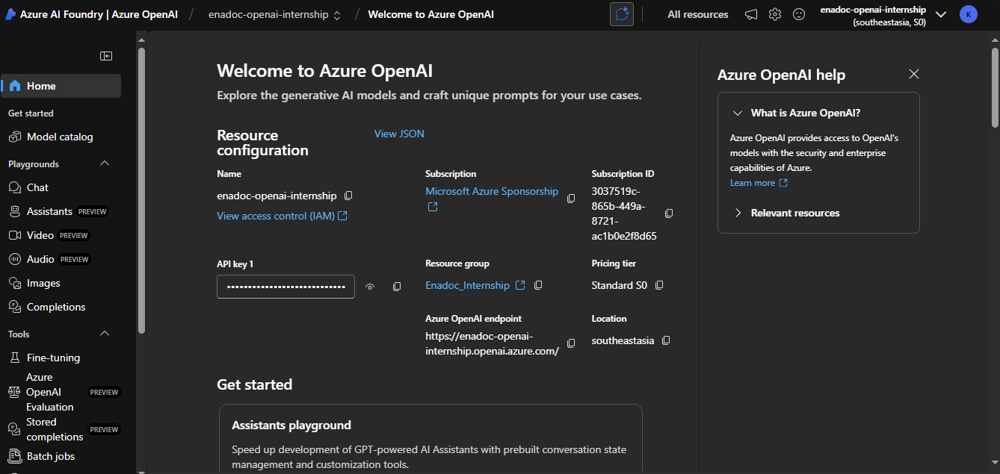

# Day 1 – 16 Jun 2025

This document summarizes my hands-on experience with the Day 1 Orientation tasks: Azure Overview, Key Vault, Redis Cache, Blob Storage, SignalR Service, and Azure OpenAI. Screenshots and exact commands are included.

---

## 1. Azure Overview

**What I read / watched**  
- Quickstart: Azure fundamentals (https://aka.ms/az-fundamentals)  
  _Key takeaways:_  
  - **Subscriptions** group billing and access.  
  - **Resource Groups (RGs)** group related resources for lifecycle management.  
  - **Regions** define the physical Azure data-center locations.

**Commands run**  
```bash
az login
# (pressed Enter to accept default subscription)
az group list --output table

Name               Location       Status
-----------------  -------------  ---------
Enadoc_Internship  southeastasia  Succeeded
```


## 2. Azure Key Vault

What I read / watched

- MS Learn: Key Vault Basics (https://aka.ms/keyvault-docs)
  Key takeaways:
        -Centralized secret & key management.
        -Supports RBAC and access policies.

# List vaults in RG (confirm name/casing)
az keyvault list --resource-group Enadoc_Internship --query "[].name" -o tsv
# → enadocintership

# Get Storage account connection string
az storage account show-connection-string \
  --resource-group Enadoc_Internship \
  --name enadocinternshipstorage \
  --query connectionString \
  -o tsv
# Copied full output beginning with "DefaultEndpointsProtocol=..."

# Create secret BlobConnStr
az keyvault secret set \
  --vault-name enadocintership \
  --name BlobConnStr \
  --value 'DefaultEndpointsProtocol=https;AccountName=enadocinternshipstorage;AccountKey=...;EndpointSuffix=core.windows.net'

# Verify the secret
az keyvault secret show \
  --vault-name enadocintership \
  --name BlobConnStr \
  --query value -o tsv

# Results 
vault name confirmed: enadocintership
Scret BlobConnStr created successfully and value verified.


## 3. Azure Redis Cache

What I read / watched

Intro to Azure Cache for Redis (https://aka.ms/redis-docs)
Key takeaways:
    -Managed, in-memory data store.
    -Supports caching for high-performance scenarios. 

Command Run : 

az redis create \
  --resource-group Enadoc_Internship \
  --name intern-redis \
  --sku Basic \
  --vm-size C0

Verification :

az redis show \
  --resource-group Enadoc_Internship \
  --name intern-redis \
  --query provisioningState -o tsv

# → Succeeded


## 4. Azure Blob Storage
   What I read / watched
        
        Blob storage overview (https://aka.ms/blob-docs)
           Key takeaways:
                Scalable object storage for unstructured data.
                Containers organize blobs.

        Portal steps
           In Portal: Resource groups → Enadoc_Internship → enadocinternshipstorage (Storage account)

        Under Data storage → Containers, created container docs (private).

        Clicked Upload, selected hello.txt, clicked Upload.


## 5. Azure SignalR Service
    What I read / watched  
             
             Real-time docs (https://aka.ms/signalr-docs)

    Key takeaways:
        Managed WebSocket / SignalR hub service.
        
        Supports real-time push to clients.

    Note: Subscription wasn’t registered for Microsoft.SignalRService, and I lack permission to register it.

    Action taken: Requested subscription-owner to register the provider in Portal under Subscriptions → Resource providers → Microsoft.SignalRService → Register.


## 6. Azure OpenAI
    What I read / watched

       Quickstart: Azure OpenAI (https://aka.ms/openai-docs)

    Key takeaways:
        Deploy and consume OpenAI models in Azure.
        Manage deployments via Azure CLI or SDK.

Commands run
# List deployments
az cognitiveservices account deployment list \
  --resource-group Enadoc_Internship \
  --name enadoc-openai-internship \
  --query "[].{name:name,model:properties.model}" -o table
# → shows "gpt-4o"

# Fetch endpoint & key
$ENDPOINT = az cognitiveservices account show --resource-group Enadoc_Internship --name enadoc-openai-internship --query properties.endpoint -o tsv
$KEY      = az cognitiveservices account keys list --resource-group Enadoc_Internship --name enadoc-openai-internship --query key1 -o tsv

# Test GPT-4o completion
curl "$ENDPOINT/openai/deployments/gpt-4o/completions?api-version=2023-05-15" \
  -H "api-key: $KEY" \
  -H "Content-Type: application/json" \
  -d '{"prompt":"Hello, world!","max_tokens":5}'


